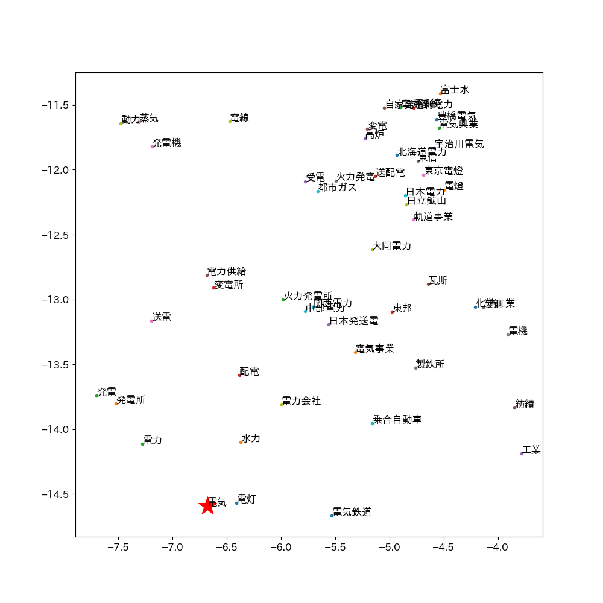

# 自然言語処理による文章のベクトル化を用いたベクトル検索システムの検索精度改善と検索結果の可視化

## 1.  **研究概要**

### 1.1. **自然言語処理とは**

自然言語処理（NLP）とは、自然言語(日本語や英語など人間が用いる言語)をコンピュータによって処理をする技術である。NLPによって、さまざまな自然言語のタスクを解くことができる。例として、文章間の類似度測定、文章分類(典型的なものとして、文章の内容がネガティブなものかポジティブなものかを判定する処理)、文章生成、文章校正などがある。[^1]

NLPにおけるベクトル化とは、単語、文章などの要素をベクトル(要素の特徴を示す数値,特徴量)に変換する処理を指す。数値として出力されるため、計算によって類似度を求めるなど、単語や文章を数値的に扱うことが可能となる。

### 2.1. **キーワード検索方式とベクトル検索**

現在一般的に使用されている検索エンジン方式の大多数はキーワード検索方式である。キーワード検索方式は、検索対象の文書に含まれるキーワードと検索クエリに含まれるキーワードの一致度を基に検索結果を順位付けする方式である。

ベクトル検索方式は、データセット上の単語や文章を前述のベクトル化処理によってベクトル化、検索クエリのベクトルから近い語を類似度計算、順位付けし、結果として表示する方式である。現在では、画像検索や音楽検索の分野などで主に活用されている。ベクトル検索は、キーワード検索では弱点となる意味を考慮した検索に優れている。意味は同じであるが書き方が複数ある語への対応（検索クエリ「力士」に対して「相撲取り」や「お相撲さん」を結果に含める）や、ベクトル化によって生成された多次元のベクトルを二次元・三次元の数値に変換、散布図によるマッピングにより要素間の距離など、検索結果を可視化することが可能である。

ベクトル検索は、要素の処理方法によって大きく精度に差が生じる。**本研究では、データセットの処理方法を変更した複数のベクトル検索モデルを作成・比較し、精度を改善する方法を研究する。また、結果の効果的な可視化システムを開発する。**

## 2.  **研究方法**

### 2.1.  **プログラムの作成**

ベクトル検索システムの開発言語にはPythonを用いる。

詳細な実行環境・使用するデータセットについては 付録 に記載した。

### 2.2.  **検索対象となる文章の処理・ベクトル化**

検索対象のデータセットとしてWikipediaの記事を用いる。Wikipedia
Dumpsから記事データを取得後、必要な情報を抜き出し、Json形式でリスト化、作成するモデル別に処理(4.結果を参照)を行う。

データの処理後、文章をベクトルに変換することができるPythonライブラリであるSentence
Transformersによりベクトル化を行う。

### 2.3.  **検索クエリのベクトル化・類似度計算**

入力された検索クエリを前述と同じ手順でベクトル化を行う。  
検索クエリのベクトルとデータセット上のベクトルのコサイン類似度(2つのベクトルがどれくらい似ているかを表す-1から1までの値)を計算し、順位付け、検索結果として表示する。

### 2.4.  **評価**

検索クエリに対する検索結果を人間の感性で評価し、処理方法による精度の差を測定する。

### 2.5.  **可視化**

データセットの多次元な文書ベクトルをTSNEにより二次元化、JavaScriptのグラフ描画ライブラリであるEChartsを使用し、文書のベクトル数値を点としてプロット(描画)、散布図を作成し、ブラウザ上で可視化する。

画像1: 単語マッピング(matplotlibを使用)、「電気」の関連語

画像2: 10000語の大規模な単語マッピング(matplotlibを使用)

**参考画像1**

  

 **参考画像2**  
  

## 3.  **仮説**

ベクトル検索の精度向上のための処理方法として3つの仮説をたて、以下の2つのモデルを用意した。

### **モデル1:文章の整形**

以下に一般的なWikipedia記事の例を示す。

「言語」『フリー百科事典　ウィキペディア日本語版』から引用

https://ja.wikipedia.org/w/index.php?curid=10  

解析に必要な内容は「文章の特徴」であり、記号(例文中の \^ a b
c)や内容と直接的な関係のない文字列(URL
https://***、出典記載)などは解析の妨げになりえると考えた。

以下のフィルターによって文章を整形し、解析精度の改善を図る。

|**処理内容**|**正規表現**|
|-|-|
|ページ内リンク記号の削除|\\\^ \[a-z \]\*|
|URLの削除|https?://\[\\w/:%\#\\\$&\\?\\(\\)\~\\.=\\+\\-\]+|
|()内の削除|\\(.\*?\\), （.\*?）|
|日付の削除|\\d{4}\[/\\.年\]\\d{1,2}\[/\\.月\]\\d{1,2}日?|

### **モデル2: 事前学習モデルの変更**

一からすべての学習を行うには膨大な時間とコストが必要となる。そのため、基礎的な言語表現に関する学習を終えたモデル(事前学習モデル)をベースとし、それぞれのタスクに特化させるためにファインチューニング(学習済みモデルを、別のデータセットによって追加で学習を行う)を行うのが一般的である。

本研究ではWikipediaの記事といった広いタスクを扱うため、ファインチューニングは行わず、精度は事前学習モデル依存となる。そのため、複数の事前学習モデルで精度の比較を行う。

### **モデル3:** 他の検索方式と組み合わせる(ハイブリット検索)

モデル4は時間的・技術的都合により、今回は採用しない。

## 3.  **結果**

### 3.1.  **精度の比較**

**使用データセット:**  
Wikipediaの日本語記事(1,386,531件)

**事前学習モデル:**

||**モデル名**|
|-|-|
|**A**|   paraphrase-xlm-r-multilingual-v1(多言語モデル)|
|**B**|stsb-xlm-r-multilingual(多言語モデル)|
|**C**|cl-tohoku/bert-base-japanese-v3(東北大日本語モデル)|

**作成したモデル:**

||事前学習モデル|モデル概要|解析時間|
|--|--|--|--|
  0 |A|未処理|                         10h45m|
  1 |A| 文章の整形||                           
  2|B|1と同様の処理、事前学習モデルを変更||   
  3|   C|                1と同様の処理、事前学習モデルを変更||   

**類似度スコア:**

-1.0 \[対象から意味合い的に離れている\]  
0 \[無関係\]  
1.0\[対象に意味合い的に近い\]

### 3.1.1. **モデル0と1の比較**

検索クエリ:

**モデル0:**

|順位|記事|類似度スコア|整合性(感性評価)|
|-|-|-|-|
|1||||
|2||||
|3|||| 
|4||||
|5||||                       

**モデル1:**

|順位|記事|類似度スコア|整合性(感性評価)|
|-|-|-|-|
|1||||
|2||||
|3|||| 
|4||||
|5||||                      

### 3.1.2.**モデル1と2と3の比較**

検索クエリ:

**モデル1:**

上を参照

**モデル2:**

|順位|記事|類似度スコア|整合性(感性評価)|
|-|-|-|-|
|1||||
|2||||
|3|||| 
|4||||
|5||||           

**モデル3:**

|順位|記事|類似度スコア|整合性(感性評価)|
|-|-|-|-|
|1||||
|2||||
|3|||| 
|4||||
|5||||        

**結果考察:**

### 3.2.**結果の可視化**

## 4.  **展望**

## **参照文献**

参考文献1:  
近江 崇宏 著、金田 健太郎 著、森長 誠 著、江間見亜利、ストックマーク株式会社. (2021).  
BERTによる自然言語処理入門Transformersを使った実践プログラミング. オーム社.

## **付録**

**実行環境**
  |||
  |-|-|
  |**OS**    |Windows 10 Pro
  |**CPU**  | Intel Xeon CPU E3-1240 3.30GHz
  |**RAM** |  DDR3L 32GB ECC
  |**GPU**|   NVIDIA GTX1660SUPER

Python 3.10.12  
Sentence-Transformers 2.2.2  
Torch 2.1.0  

**使用データセット・プログラム**

**・深層学習モデル**

Sentence Transformers  
<https://github.com/UKPLab/sentence-transformers>

**・事前学習モデル**

paraphrase-xlm-r-multilingual-v1  
<https://huggingface.co/sentence-transformers/paraphrase-xlm-r-multilingual-v1>

stsb-xlm-r-multilingual  
<https://huggingface.co/sentence-transformers/stsb-xlm-r-multilingual>

cl-tohoku/bert-base-japanese-v3  
<https://huggingface.co/cl-tohoku/bert-base-japanese-v3>

**・検索対象データセット**

Wikipedia Dumps(日本語)  
<https://dumps.wikimedia.org/>

### **研究GitHubレポジトリ(QRコード)**
<https://github.com/10nm/nlp>  

[^1]: 参考文献 1
