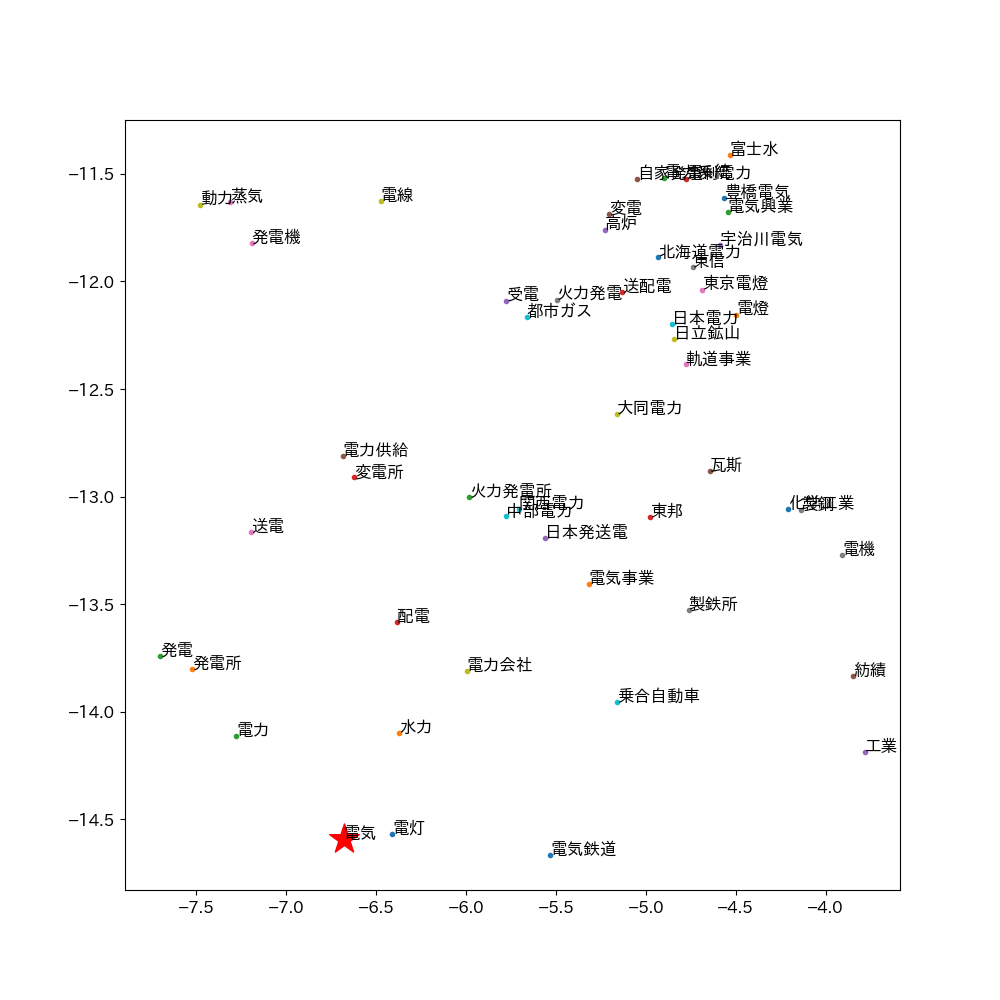

# **自然言語処理による文章のベクトル化を用いたベクトル検索システムの検索精度改善と検索結果の可視化**
愛知総合工科高等学校 １年 近藤 大紀

## 1.**研究概要**
    
### 1.  **自然言語処理とは**

自然言語処理（NLP）とは、自然言語(日本語や英語など人間が用いる言語)をコンピュータによって処理をする技術であり、さまざまな自然言語のタスクを解くことができる。例として、文章間の類似度測定、文章分類(典型的なものとして、文章の内容がネガティブなものかポジティブなものかを判定する処理)、文章生成、文章校正などがある。\[1\]

NLPにおけるベクトル化とは、単語、文章などの要素をベクトル(要素の特徴を示す数値,特徴量)に変換する処理を指す。数値として出力されるため、単語や文章を数値的に扱うことが可能となる。

### 2.**キーワード検索方式とベクトル検索**

現在一般的に使用されている検索エンジン方式の大多数はキーワード検索方式である。キーワード検索方式は、検索対象の文書に含まれるキーワードと検索クエリに含まれるキーワードの一致度を基に検索結果を順位付けする方式である。

ベクトル検索方式は、データベース上の単語や文章を前述のベクトル化処理によってベクトル化、検索クエリのベクトルから近い語を類似度計算、順位付けし、結果として表示する方式である。現在では、画像検索や音楽検索の分野などで主に活用されている。ベクトル検索は、キーワード検索では弱点となる意味を考慮した検索に優れている。意味は同じであるが書き方が複数ある語への対応（検索クエリ「力士」に対して「相撲取り」や「お相撲さん」を結果に含める）や、ベクトル化によって生成された多次元のベクトルを二次元・三次元の数値に変換、散布図によるマッピングにより要素間の距離など、検索結果を可視化することが可能である。

ベクトル検索は、要素の処理方法によって大きく精度に差が生じる。**本研究では、データセットの処理方法を変更した複数のベクトル検索モデルを作成・比較し、精度を改善する方法を研究する。また、結果の効果的な可視化システムを開発する。**

## 2.**研究方法**
    
### 1.  **プログラムの作成**

ベクトル検索システムの開発言語にはPythonを用いる。

詳細な実行環境・使用するデータセットについては 付録 に記載した。

### 1.**検索対象となる文章の処理・ベクトル化**

検索対象のデータセットとしてWikipediaの記事を用いる。Wikipedia Dumpsから記事データを取得後、必要な情報を抜き出し、Json形式でリスト化、作成するモデル別に処理(4.結果 を参照)を行う。

データの処理後、文章をベクトルに変換することができるPythonライブラリであるSentence Transformersによりベクトル化を行う。

### 2.**検索クエリのベクトル化・類似度計算**

入力された検索クエリを前述と同じ手順でベクトル化を行う。  
検索クエリのベクトルとデータセット上のベクトルのコサイン類似度(2つのベクトルがどれくらい似ているかを表す-1から1までの値)を計算し、順位付け、検索結果として表示する。

### 2.  **評価**

検索クエリに対する検索結果を人間の感性で評価し、処理方法による精度の差を測定する。

### 3.  **可視化**

データセットの多次元な文書ベクトルをTSNEにより二次元化、Pythonのグラフ描画ライブラリであるmatplotlibを使用し、文書のベクトル数値を点としてプロット(描画)、散布図を作成し、可視化する。

画像1: 単語のマッピング(matplotlibを使用)、「電気」の関連語  
画像2: 10000語の大規模な単語マッピング(matplotlibを使用)

**参考画像1**

 **参考画像2**

### 2.  **仮説**

ベクトル検索の精度向上のための処理方法として3つの仮説をたて、5つのモデルを用意した。

**手法1:文章の整形**

以下に一般的なWikipedia記事の例を示す。

「言語」『フリー百科事典　ウィキペディア日本語版』から引用

https://ja.wikipedia.org/w/index.php?curid=10 

解析に必要な要素は「文章の特徴」であり、記号(例文中の ^ a b c)や内容と直接的な関係のない文字列(URL <https://***>、出典記載)などは解析の妨げになりえると考えた。

以下のフィルターによって文章を整形し、解析精度の改善を図る。

| **処理内容**     | **正規表現**                                        |
| ------------ | ----------------------------------------------- |
| ページ内リンク記号の削除 | \\^ \[a-z \]\*                                  |
| URLの削除       | https?://\[\\w/:%\#\\$&\\?\\(\\)\~\\.=\\+\\-\]+ |
| ()内の削除       | \\(.\*?\\), （.\*?）                              |
| 日付の削除        | \\d{4}\[/\\.年\]\\d{1,2}\[/\\.月\]\\d{1,2}日?      |

**手法2: 事前学習モデルの変更**  

一からすべての学習を行うには膨大な時間とコストが必要となる。そのため、基礎的な言語表現に関する学習を終えたモデル(事前学習モデル)をベースとし、それぞれのタスクに特化させるためにファインチューニング(学習済みモデルを、別のデータセットによって追加で学習を行う)を行うのが一般的である。

本研究ではWikipediaの記事といった幅の広いタスクを扱うため、ファインチューニングは行わず、精度は事前学習モデル依存となる。そのため、複数の事前学習モデルで精度の比較を行う。

**手法3: 極端に短いページの削除**

前述の手法による検索モデルの結果には関連性の薄いページが上位に見られ、どれも文章量が極端に少ないページであった。情報量が不十分で適切なベクトルが生成できなかったことによるものだと考えられる。それらを踏まえて、一定文字数以下のページを削除する処理によって、精度の改善を図る。

**手法4: 他の検索方式と組み合わせる(ハイブリット検索)**

ハイブリット検索は、複数の検索手法を組み合わせた検索手法である。確実性の高いキーワード検索と、柔軟性の高いベクトル検索を組み合わせることにより、より高精度な検索が実現できる可能性があると考えたが、技術的都合により、今回は採用しない。

## 3.  **結果**
    
### 1.  **精度の比較**

**使用データセット:**

Wikipediaの日本語記事(1,386,531件)

**事前学習モデル:**

|       | **モデル名**                                   |
| ----- | ------------------------------------------ |
| **A** | paraphrase-xlm-r-multilingual-v1(多言語モデル)   |
| **B** | stsb-xlm-r-multilingual(多言語モデル)            |
| **C** | cl-tohoku/bert-base-japanese-v3(東北大日本語モデル) |

**作成したモデル: (モデル番号、事前学習モデル)**

<table>
<thead>
<tr class="header">
<th></th>
<th>モデル概要</th>
<th>ページ数</th>
<th>解析時間</th>
</tr>
</thead>
<tbody>
<tr class="odd">
<td>
0

A
</td>
<td>未処理</td>
<td>
1,386,531

(100%)
</td>
<td>10時間45分</td>
</tr>
<tr class="even">
<td>
1

A
</td>
<td>文章整形処理(手法1)</td>
<td>
1,386,531

(100%)
</td>
<td>9時間30分</td>
</tr>
<tr class="odd">
<td>
2

A
</td>
<td>1と同様の処理+短いページの削除(手法3)</td>
<td>
1,149,000

(82.9%)
</td>
<td>7時間15分</td>
</tr>
<tr class="even">
<td>
3

B
</td>
<td>2と同様の処理+事前学習モデルを変更(手法2)</td>
<td>
1,149,000

(82.9%)
</td>
<td>7時間10分</td>
</tr>
<tr class="odd">
<td>
4

C
</td>
<td>2と同様の処理+事前学習モデルを変更(手法2)</td>
<td>
1,149,000

(82.9%)
</td>
<td>11時間20分</td>
</tr>
</tbody>
</table>

**類似度スコア:**

\-1.0\[対象から意味合い的に離れている\]  
0 \[無関係\]  
1.0\[対象に意味合い的に近い\]

**精度評価:**

人間の感性でクエリに対する検索精度を評価する。

◎(3ポイント): クエリに一致している

〇(2ポイント): クエリと関連性が高い

△(1ポイント): クエリに関連性がある

×(0ポイント): クエリと意味が離れている

### 1.  **モデル0と1と2の比較**

検索クエリ: **自然言語処理**

**モデル0: 8ポイント**

| 順位 | 記事     | 類似度スコア | 精度評価 |
| -- | ------ | ------ | ---- |
| 1  | 自然言語生成 | 0.7652 | ◎    |
| 2  | 流暢     | 0.7453 | ×    |
| 3  | 自然言語   | 0.7276 | 〇    |
| 4  | 自然言語処理 | 0.7204 | ◎    |
| 5  | 広義     | 0.6939 | ×    |

**モデル1: 8ポイント**

| 順位 | 記事     | 類似度スコア | 精度評価 |
| -- | ------ | ------ | ---- |
| 1  | 流暢     | 0.7453 | ×    |
| 2  | 自然言語   | 0.7192 | 〇    |
| 3  | 自然言語処理 | 0.7105 | ◎    |
| 4  | 自然言語生成 | 0.6979 | ◎    |
| 5  | 広義     | 0.6939 | ×    |

**モデル2: 15ポイント**

| 順位 | 記事     | 類似度スコア | 精度評価 |
| -- | ------ | ------ | ---- |
| 1  | 自然言語   | 0.7912 | 〇    |
| 2  | 自然言語処理 | 0.7105 | ◎    |
| 3  | 自然言語生成 | 0.6979 | ◎    |
| 4  | 構文解析   | 0.6541 | 〇    |
| 5  | 人工言語   | 0.6295 | 〇    |

### 2.  **モデル2と3と4の比較**

**モデル2: 16ポイント**

上を参照

**モデル3: 6ポイント**

| 順位 | 記事        | 類似度スコア | 精度評価 |
| -- | --------- | ------ | ---- |
| 1  | 自然言語      | 0.7222 | 〇    |
| 2  | エプン語(言語学) | 0.6761 | ×    |
| 3  | レナード・タルミ  | 0.6665 | ×    |
| 4  | 自然言語生成    | 0.6628 | ◎    |
| 5  | 音声認識      | 0.6325 | △    |

**モデル4: 8ポイント**

| 順位 | 記事      | 類似度スコア | 精度評価 |
| -- | ------- | ------ | ---- |
| 1  | データ定義言語 | 0.7724 | △    |
| 2  | 正規LR法   | 0.7712 | 〇    |
| 3  | 抽象構文    | 0.7706 | △    |
| 4  | 構文解析    | 0.7706 | 〇    |
| 5  | LR法     | 0.7703 | 〇    |

### **結果考察**

モデル1の文章整形処理による影響はとても小さかった。先頭から700字のみ取得する処理の影響で、記事後半に集中しているURLや記号類が無視されたこと、削除対象となる文字列を選択するフィルターの種類が不十分であったことが原因として考えられる。

モデル2の短いページの削除処理は、モデル0,1上位で見られた低評価な検索結果を排除することに成功していた。掲載外の上位結果にも大きく改善が見られており、仮説通り絶大な効果が得られた。

事前学習モデルを変更したモデル3,4では、精度の低下が起きてしまった。知識不足による不適切な設定が要因かもしれない。

## 4.  **展望**

今回の研究で、検索対象となる文章の処理によって精度の改善に成功したが、データ量が膨大であり、全モデルにおいて一度の検索に10分以上かかることが問題点であると考えた。モデルの圧縮処理など、何らかの手法において軽量化、速度の改善をしたい。

今回、モデルの評価基準が人間の感性であった。自然言語処理における評価手法はいろいろあり、評価用データセットなどは一般に数多く配布されているため、それを活用するなど、定量的な評価ができるようにしたい。

また、題目にある検索結果の可視化は時間・技術的に実現できなかった。技術力を上げてから出直したい。

## **付録**

**実行環境**

OS: Windows 10 Pro  
CPU: Intel Xeon CPU E3-1240 3.30GHz  
RAM: DDR3L 32GB ECC  
GPU: NVIDIA GTX1660SUPER

**使用ソフトウェア**  

Python 3.10.12  
Sentence-Transformers 2.2.2  
Torch 2.1.0

**使用モデル,データセット**

**・深層学習モデル**

Sentence Transformers  
<https://github.com/UKPLab/sentence-transformers>

**・事前学習モデル**

paraphrase-xlm-r-multilingual-v1  
<https://huggingface.co/sentence-transformers/paraphrase-xlm-r-multilingual-v1>

stsb-xlm-r-multilingual  
<https://huggingface.co/sentence-transformers/stsb-xlm-r-multilingual>

cl-tohoku/bert-base-japanese-v3

<https://huggingface.co/cl-tohoku/bert-base-japanese-v3>

**・データセット**

Wikipedia Dumps(日本語)  
<https://dumps.wikimedia.org/>

ソースコード,ポスター(markdown形式)  
**研究GitHubレポジトリ(右QRコード)**  
<https://github.com/10nm/nlp> 
 

## **参照文献**

1.  
近江 崇宏 著、金田 健太郎 著、森長 誠 著、江間見 亜利、ストックマーク株式会社. (2021). BERTによる自然言語処理入門 Transformersを使った実践プログラミング. オーム社.

1.  参考文献 1
