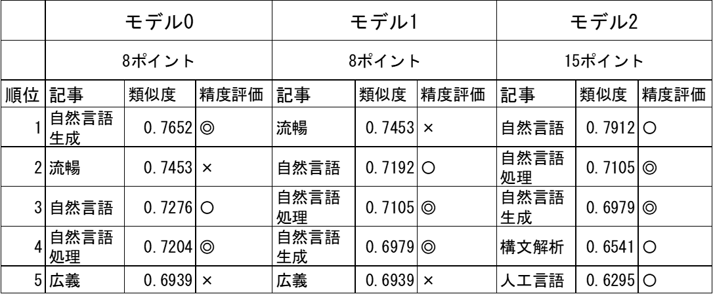

# 自然言語処理による文章のベクトル化を用いたベクトル検索システムの検索精度改善と検索結果の可視化

## 1. 研究概要

### 1.1. 自然言語処理とは

自然言語処理（NLP）とは、自然言語(日本語や英語など人間が用いる言語)をコンピュータによって処理をする技術であり、文章間の類似度測定、文章分類(典型的なものとして、文章の内容がネガティブなものかポジティブなものかを判定する処理)、文章生成、文章校正など、さまざまな自然言語のタスクを解くことができる。[^1]

NLPにおけるベクトル化とは、単語、文章などの要素をベクトル(要素の特徴を示す数値,特徴量)に変換する処理を指す。数値として出力されるため、単語や文章を数値的に扱うことが可能となる。

## 2. キーワード検索方式とベクトル検索

現在一般的に使用されている検索エンジン方式の大多数はキーワード検索方式である。キーワード検索方式は、検索対象の文書に含まれるキーワードと検索クエリに含まれるキーワードの一致度を基に検索結果を順位付けする方式である。

ベクトル検索方式は、データベース上の単語や文章を前述のベクトル化処理によってベクトル化、検索クエリのベクトルから近い語を類似度計算、順位付けし、結果として表示する方式である。現在では、画像検索や音楽検索の分野などで主に活用されている。ベクトル検索は、キーワード検索では弱点となる意味を考慮した検索に優れている。意味は同じであるが書き方が複数ある語への対応（検索クエリ「力士」に対して「相撲取り」や「お相撲さん」を結果に含める）や、ベクトル化によって生成された多次元のベクトルを二次元・三次元の数値に変換、散布図によるマッピングにより要素間の距離など、検索結果を可視化することが可能である。

ベクトル検索は、要素の処理方法によって大きく精度に差が生じる。本研究では、データセットの処理方法を変更した複数のベクトル検索モデルを作成・比較し、精度を改善する方法を研究する。また、結果の効果的な可視化システムを開発する。

## 2. 研究方法

### 2.1. プログラムの作成

ベクトル検索システムの開発言語にはPythonを用いる。

詳細な実行環境・使用するデータセットについては 付録 に記載した。

### 2.1.1.  検索対象となる文章の処理・ベクトル化 

検索対象のデータセットとしてWikipediaの記事を用いる。Wikipedia
Dumpsから記事データを取得後、必要な情報を抜き出し、Json形式でリスト化、作成するモデル別に処理(4.結果
を参照)を行う。

データの処理後、自然言語処理のフレームワークであるSentence
Transformersによりベクトル化を行う。

### 2.1.2. 検索クエリのベクトル化・類似度計算

入力された検索クエリを前述と同じ手順でベクトル化を行う。

検索クエリのベクトルとデータセット上のベクトルのコサイン類似度(2つのベクトルがどれくらい似ているかを表す-1から1までの値)を計算し、順位付け、検索結果として表示する。

### 2.2.  評価

検索クエリに対する検索結果を人間の感性で評価し、処理方法による精度の差を測定する。

### 2.3. 可視化

データセットの多次元な文書ベクトルを2次元化、散布図を作成し、可視化する。

## 3. 仮説

ベクトル検索の精度向上のための処理として4つの仮説をたてた。

### 手法1: 文章の整形

解析に必要な要素は「文章の特徴」であり、記号(例文中の \^ a b
c)や内容と直接的な関係のない文字列
(URL <https://***>、出典記載)などは解析の妨げになりえると考えた。  
下表のフィルターにより文字列を削除し、検索精度の改善を図る。

  |**処理内容**   |    **正規表現**|
  |-|-|
  | リンク記号の削除 |   \\\^ \[a-z \]\*|
  |URLの削除        |  https?://\[\\w/:%\#\\\$&\\?\\(\\)\~\\.=\\+\\-\]+|
  |()内の削除       |  \\(.\*?\\), （.\*?）|
  |日付の削除     |    \\d{4}\[/\\.年\]\\d{1,2}\[/\\.月\]\\d{1,2}日?|

### 手法2: 事前学習モデルの変更

一からすべての学習を行うには膨大な時間とコストが必要となる。そのため、基礎的な言語表現に関する学習を終えたモデル(事前学習モデル)をベースとし、それぞれのタスクに特化、精度の向上を目的として
ファインチューニング(学習済みモデルを、別のデータセットによって追加で学習を行う)を行うのが一般的である。  
本研究ではWikipediaの記事といった幅の広いタスクを扱うため、ファインチューニングは行わず、精度は事前学習モデル依存となる。複数の事前学習モデルで精度の比較を行い、よりタスクに適した事前学習モデルを選定することにより、精度の改善を図る。

### 手法3: 極端に短いページの削除

記事のベクトル化の過程では、文章量の大小に関わらず、同じ基準でベクトルが生成される。文章量が極端に少ないページでは、情報量が不十分となり、不適切なベクトル生成が行われる可能性がある。それらを踏まえて、一定文字数以下のページを削除する処理によって、精度の改善を図る。

### 手法4: 他の検索方式と組み合わせる(ハイブリット検索)

ハイブリット検索とは、複数の検索手法を組み合わせた検索手法である。確実性の高いキーワード検索と、柔軟性の高いベクトル検索を組み合わせることにより、精度の改善を図る。

## 3.  結果

### 1.  精度の比較

使用データセット: 
Wikipediaの日本語記事(1,386,531件)

事前学習モデル:

| |**モデル名**|
|-|-|
|**A** |  paraphrase-xlm-r-multilingual-v1(多言語モデル)|
|**B** |   stsb-xlm-r-multilingual(多言語モデル)|
|**C** |  cl-tohoku/bert-base-japanese-v3(東北大日本語モデル)

作成したモデル:

||手法|事前学習|ページ割合|解析時間|
|-|-|-|-|-|
  |0  | 未処理|      A         | 1,386,531件 (100%) |   10時間45分
  |1 |  1   |        A  |        1,386,531件 (100%)  |  9時間30分|
  |2|   1 + 3 |      A     |     1,149,000件 (82.9%)  | 7時間15分|
  3 |  1 + 3 + 2 |  B          |1,149,000件 (82.9%) |  7時間10分|
  4  | 1 + 3 + 2|   C       |   1,149,000件 (82.9%)|   11時間20分|

**類似度:**

◎: 3ポイント 〇: 2ポイント

△: 1ポイント ×: 0ポイント

### 4.1.1.  モデル0と1と2の比較

検索クエリ: 自然言語処理

{width="4.166888670166229in"
height="1.7242989938757656in"}

2.  モデル2と3と4の比較

検索クエリ: 自然言語処理

{width="4.165877077865267in"
height="1.7149529746281715in"}

2.  結果考察

モデル1の文章整形処理による影響はとても小さかった。先頭から700字のみ取得する処理の影響で、記事後半に集中しているURLや記号類が無視されたこと、削除対象となる文字列を選択するフィルターの種類が不十分であったことが原因として考えられる。

モデル2の短いページの削除処理は、モデル0,1上位で見られた低評価な検索結果を排除することに成功していた。掲載外の上位結果にも大きく改善が見られており、仮説通り絶大な効果が得られた。

事前学習モデルを変更したモデル3,4では、精度の低下が起きてしまった。知識不足によるチューニング不足が原因だと考えられる。

4.  可視化

ベクトル化によって生成された文章ベクトルは多次元である。

単語「自然言語処理」のベクトル(約700次元)

{width="2.9166666666666665in"
height="0.7006944444444444in"}

高次元データを2次元又は3次元に変換して可視化するための次元削減アルゴリズム[^2]
であるt-SNEを使用して、多次元の文章ベクトルを2次元に変換、二つの値をX,Y座標とした。

2次元に変換した単語「自然言語処理」のベクトル

{width="1.202311898512686in"
height="0.5014129483814523in"}

Pythonのグラフ描画ライブラリである
Matplotlibを使用し、文章のベクトルを散布図にして可視化した。

**散布図1**モデル2を使用

{width="2.9948797025371827in"
height="2.350515091863517in"}

「音声認識」と「音声言語」,「自然言語処理」に「形態素分析(自然言語処理における重要な処理)」など、意味が近そうな単語は近く、表右上のように、意味が外れている結果は遠くに、固まって表示された。

「自然言語」に対して「人工言語」など、対義語であるはずの単語が近くに配置されていた。本質的な意味合いを考慮したベクトル化は十分に実現できていないことが分かった。

類似度を順位付けして表示するだけではわからなかった単語間の関係性が、散布図にすることによって視覚的に理解することができるようになった。また、改善点も見つけることができた。散布図による検索結果の可視化は効果的であることが分かった。

5.  展望

今回の研究で、検索対象となる文章の処理によって精度の改善に成功したが、データ量が膨大であり、全モデルにおいて一度の検索に10分以上かかることが問題点であると考えた。モデルの圧縮処理など、何らかの手法において軽量化、速度の改善をしたい。

今回、モデルの評価基準が人間の感性であった。自然言語処理における評価手法はいろいろあり、評価用データセットなどは一般に数多く配布されているため、それを活用するなど、定量的な評価ができるようにしたい。

技術的都合により実現できなかったハイブリット検索の実装も今後試していきたいと思った。

付録

使用モデル,データセット

・深層学習モデル

> Sentence Transformers
>
> <https://github.com/UKPLab/sentence-transformers>

**・**事前学習モデル

1.  paraphrase-xlm-r-multilingual-v1

<https://huggingface.co/sentence-transformers/paraphrase-xlm-r-multilingual-v1>

2.  stsb-xlm-r-multilingual

https://huggingface.co/sentence-transformers/stsb-xlm-r-multilingual

3.  cl-tohoku/bert-base-japanese-v3

<https://huggingface.co/cl-tohoku/bert-base-japanese-v3>

・データセット

Wikipedia Dumps(日本語)

<https://dumps.wikimedia.org/>

{width="0.8604166666666667in"
height="0.8604166666666667in"}

ソースコード,ポスター(markdown形式)

**研究GitHubレポジトリ(右QRコード)**

<https://github.com/10nm/nlp> 
=============================

**参照文献**
============

1\. 近江 崇宏 著、金田 健太郎 著、森長 誠 著、江間見 亜利
ストックマーク株式会社. (2021). BERTによる自然言語処理入門
Transformersを使った実践プログラミング. オーム社.2. g-k.
(2020年06月02日). t-SNEを理解して可視化力を高める. 参照先: Qiita:
https://qiita.com/g-k/items/120f1cf85ff2ceae4aba

[^1]: 参照文献 1

[^2]: 参考文献2
